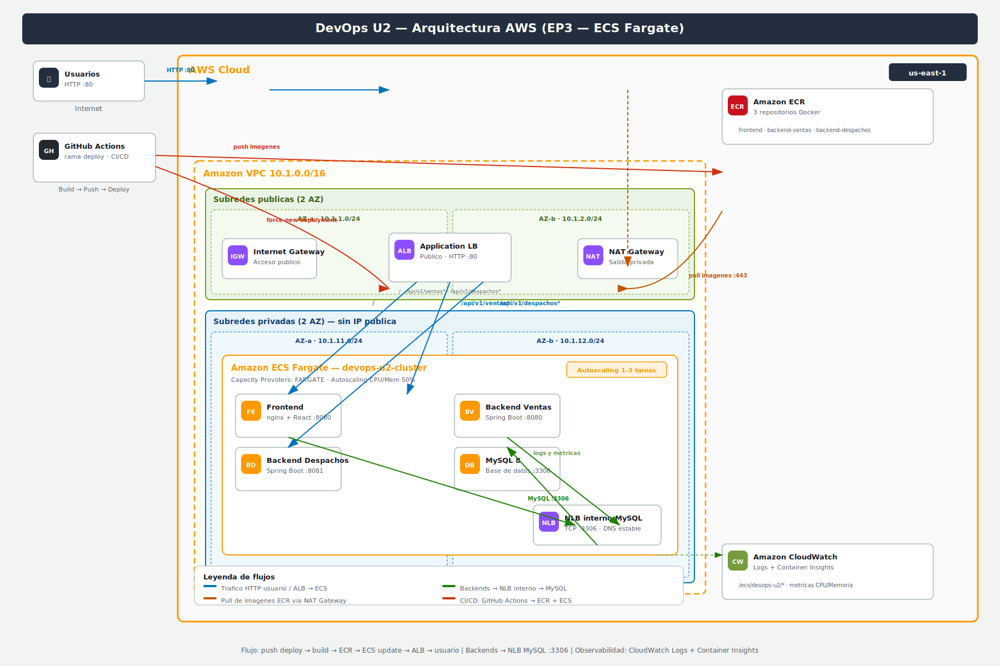

# DevOps U2 — ECS Fargate + Terraform + CI/CD

Sistema de gestión de **ventas** y **despachos** desplegado en AWS con Docker, Amazon ECR, **ECS Fargate**, **ALB** (enrutamiento por path), **NLB** interno para MySQL y pipelines de **GitHub Actions**.

**Repositorio:** [FelipeArdiles/devops-ev2](https://github.com/FelipeArdiles/devops-ev2)  
**Autor:** Felipe Ardiles — Duoc UC

## Arquitectura



| Componente | Descripción |
|------------|-------------|
| **ALB** | Punto de entrada público HTTP :80. Enruta `/` al frontend y `/api/v1/*` a los backends. |
| **ECS Fargate** | 4 servicios: frontend (nginx), backend-ventas, backend-despachos y MySQL. |
| **NLB interno** | Balanceador privado para que los backends conecten a MySQL sin IP pública. |
| **ECR** | 3 repositorios de imágenes Docker (frontend + 2 backends). |
| **CloudWatch** | Logs de contenedores en `/ecs/devops-u2/*`. |

## Stack tecnológico

| Capa | Tecnología |
|------|------------|
| Frontend | React 18 + Vite + nginx (usuario no root) |
| Backends | Spring Boot 17 — ventas `:8080`, despachos `:8081` |
| Base de datos | MySQL 8 en ECS Fargate |
| Infraestructura | Terraform — `etapa_1` (ECR) + `etapa_3` (VPC, ECS, ALB, NLB) |
| CI | Push/PR → `docker compose build` + healthcheck de APIs |
| CD | Push a rama `deploy` → build ECR → `force-new-deployment` ECS |

## Estructura del proyecto

```
├── backend/
│   ├── ventas/              # API Spring Boot ventas
│   └── despachos/           # API Spring Boot despachos
├── frontend/                # React + nginx (modos local, ALB y EC2)
├── infra/
│   ├── etapa_1/             # Repositorios ECR
│   ├── etapa_2/             # Stack EC2 legacy (referencia)
│   └── etapa_3/             # ECS Fargate + ALB + NLB (producción)
├── .github/workflows/
│   ├── ci.yml               # Integración continua
│   └── deploy.yml           # Despliegue continuo ECS
├── docs/
│   └── arquitectura-aws.svg
├── scripts/
│   ├── deploy-evaluacion.sh # Despliegue/destrucción manual
│   └── deploy.env.example
├── docker-compose.yml
├── GITFLOW.md
└── README.md
```

## Requisitos previos

- [Docker](https://docs.docker.com/get-docker/) y Docker Compose
- [Terraform](https://developer.hashicorp.com/terraform/install) >= 1.5
- [AWS CLI](https://aws.amazon.com/cli/) v2
- Cuenta **AWS Academy** (VocLabs) con lab activo
- [GitHub CLI](https://cli.github.com/) (opcional, para gestionar secrets)

## Desarrollo local

```bash
cp .env.example .env
docker compose up --build
```

| Recurso | URL |
|---------|-----|
| Frontend | http://localhost |
| API ventas | http://localhost/api/v1/ventas |
| API despachos | http://localhost/api/v1/despachos |

Los backends cargan datos de demostración al iniciar (`DatosInicialesVentas`, `DatosInicialesDespachos`).

## Despliegue en AWS

### Opción A — Script automatizado (recomendado para evaluación)

```bash
# 1. Iniciar lab en AWS Academy y exportar credenciales temporales
export AWS_ACCESS_KEY_ID=...
export AWS_SECRET_ACCESS_KEY=...
export AWS_SESSION_TOKEN=...

# 2. (Opcional) Personalizar variables
cp scripts/deploy.env.example scripts/deploy.env

# 3. Desplegar infra + imágenes + ECS
./scripts/deploy-evaluacion.sh deploy

# 4. Copiar el DNS del ALB al secret de GitHub (ver tabla abajo)
```

### Opción B — Terraform manual + pipeline

```bash
# 1. Credenciales AWS en terminal (lab activo)

# 2. Crear repositorios ECR
cd infra/etapa_1
terraform init && terraform apply

# 3. Levantar ECS, ALB y NLB
cd ../etapa_3
cp terraform.tfvars.example terraform.tfvars   # editar db_password
terraform init && terraform apply

# 4. Obtener URL pública
terraform output application_url

# 5. Configurar secrets en GitHub (tabla siguiente)

# 6. Desplegar vía CI/CD
git checkout deploy
git merge main
git push origin deploy
```

### Secrets de GitHub Actions

Configurar en **Settings → Secrets and variables → Actions**:

| Secret | Descripción |
|--------|-------------|
| `AWS_ACCESS_KEY_ID` | Credencial temporal del lab AWS Academy |
| `AWS_SECRET_ACCESS_KEY` | Credencial temporal del lab |
| `AWS_SESSION_TOKEN` | Token de sesión (obligatorio en VocLabs) |
| `ECS_ALB_DNS_NAME` | Solo el hostname del ALB, sin `http://` (output `alb_dns_name` de Terraform) |

> Las credenciales de AWS Academy **expiran** al cerrar el lab o tras unas horas. Si el pipeline de deploy falla con *"The security token included in the request is invalid"*, actualiza los tres secrets AWS y vuelve a ejecutar el workflow.

## Pipelines CI/CD

### Integración continua (`ci.yml`)

Se ejecuta en push/PR a `main`, `develop` y ramas `feature/**` / `fix/**`:

1. `docker compose build`
2. `docker compose up -d`
3. Verifica `http://localhost/api/v1/ventas` y `/api/v1/despachos`

### Despliegue continuo (`deploy.yml`)

Se ejecuta solo con push a la rama **`deploy`**:

1. Login en ECR
2. Build y push de las 3 imágenes (`linux/amd64`)
3. Espera estabilidad de MySQL
4. `force-new-deployment` en frontend y backends
5. Verifica frontend y APIs vía ALB

## URLs en producción

Reemplazar `<ALB_DNS>` por el valor de `terraform output -raw alb_dns_name`:

| Recurso | URL |
|---------|-----|
| Frontend | `http://<ALB_DNS>/` |
| API ventas | `http://<ALB_DNS>/api/v1/ventas` |
| API despachos | `http://<ALB_DNS>/api/v1/despachos` |
| Swagger ventas | `http://<ALB_DNS>/api/v1/ventas/swagger-ui.html` |
| Swagger despachos | `http://<ALB_DNS>/api/v1/despachos/swagger-ui.html` |

## Gitflow

Ver [GITFLOW.md](GITFLOW.md) para el flujo completo:

```
feature/*  →  develop  →  main  →  deploy
                              ↑         ↑
                             CI        CD (AWS)
```

## Comandos útiles

```bash
# Estado de servicios ECS y URL de la app
./scripts/deploy-evaluacion.sh status

# Ver outputs de Terraform
cd infra/etapa_3 && terraform output

# Logs en CloudWatch (ejemplo)
aws logs tail /ecs/devops-u2/backend-ventas --follow --region us-east-1
```

## Apagar recursos

Al terminar la evaluación o el lab, destruir la infraestructura para no consumir créditos:

```bash
./scripts/deploy-evaluacion.sh destroy
```

## Solución de problemas

| Síntoma | Causa probable | Acción |
|---------|----------------|--------|
| Deploy falla en ~10 s con token inválido | Secrets AWS vencidos | Renovar credenciales del lab y actualizar secrets |
| CI falla en build del frontend | Archivo nginx incorrecto | Verificar que exista `frontend/nginx.local.conf` |
| Tasks ECS en exit 137 | OOM (memoria insuficiente) | Revisar límites de memoria en `infra/etapa_3/ecs.tf` |
| APIs no responden tras deploy | Backends aún iniciando | Esperar 3–5 min; revisar logs en CloudWatch |
| `ECS_ALB_DNS_NAME` incorrecto | DNS desactualizado tras nuevo `terraform apply` | Actualizar secret con el nuevo `alb_dns_name` |

## Licencia

Proyecto académico — Duoc UC, Quinto semestre, asignatura DevOps.
